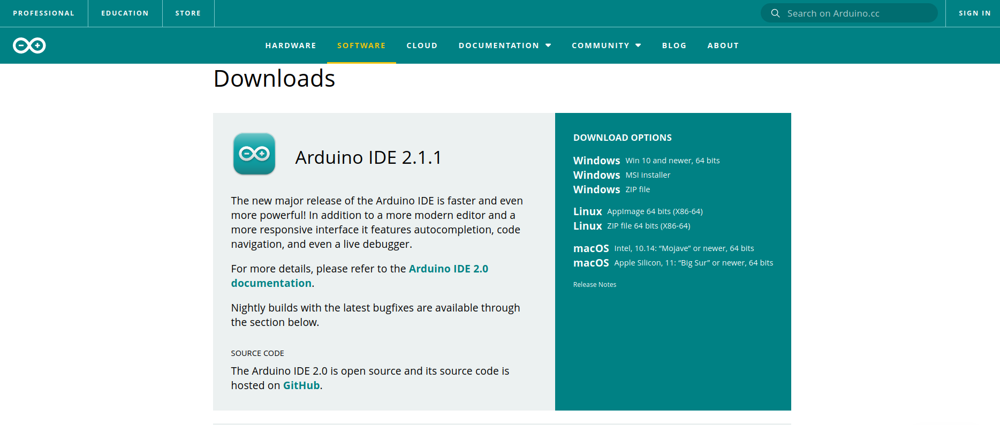

##  Download And Install The Arduino IDE

Arduino IDE version 2.1.X is used to upload a server to the Minima or WIFI. It is also 
used to modify server source code when configuration is necessary.

To install a copy of the IDE, go to the [Arduino Software Download page](https://www.arduino.cc/en/software), and 
select the version for your 
operating system. Follow the installation instructions.

## A Note For Linux Users
You may need to add your login to the dialout group to upload to the Arduino.

To do so, follow [these instructions](https://support.arduino.cc/hc/en-us/articles/360016495679-Fix-port-access-on-Linux).

 
Copyright (C) 2023 Alan Yorinks. All Rights Reserved.