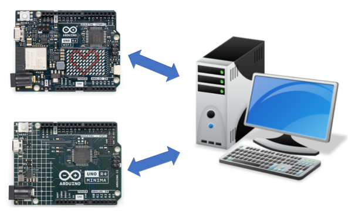

<div style="text-align:center;color:#990033; font-family:times, serif;font-size:2.5em"><i>Telemetrix User's Guide</i></div>
<div style="text-align:center;color:#990033; font-family:times, serif;font-size:2.5em"><i>For The</i></div>
<div style="text-align:center;color:#990033; font-family:times, serif;font-size:2.5em"><i>Arduino UNO R4 Minima and WIFI  </i></div>

<br>

</img>

*Telemetry* is a system for collecting data on a remote device and then 
automatically transmitting the collected data back to local receiving equipment for 
processing. 

With Telemetrix, you can do things such as establish a GPIO pin as a PWM output pin and 
set its value to run a DC motor, communicate with your favorite i2c device, 
have the WIFI's LEDs scroll a message, or monitor temperature using a DHT temperature 
device, and much more, 
all within a Python application.

## Telemetrix Client-Server Model
Telemetrix is implemented using a client-server model.
A "fixed" server is uploaded to the Arduino.

The server communicates with a Telemetrix Python client that sends commands to 
the Arduino and receives data reports.

Application debugging is simplified by using your favorite Python toolset.

#Telemetrix Client-Server Transports

The Arduino UNO R4 Minima uses a USBSerial transport.

For the Arduino UNO R4 WIFI, you can choose a WIFI, USBSerial or BLE transport. 
There are servers for each of the transport types.

## Both Threaded And ASYNCIO Client APIs Are Available For Each Board  

Choose whichever one suits your needs.

The transport type is specified for the UNO R4 WIFI when Telemetrix is instantiated.

# Data Is Reported Using Callback Methods

When you set a pin mode as an input type, a user-provided callback method is 
registered to provide data change notifications.
Callbacks ensure that data changes
are processed as soon as possible and that no data change events are lost. 
Each data change is time-stamped as it is received.

You may implement the callback scheme as a single callback to 
handle all data change events or multiple individual callbacks to handle 
specific pins or input device types, giving you maximum flexibility.

##  Automatic Data Reporting
Data is reported automatically without polling for analog inputs, 
digital inputs, DHT temperature sensors, and HC-SR04 distance sensors. 
Once a pin mode is set, reporting begins immediately.


<br>

# Summary Of Major Features

* Applications are programmed using Python 3.8 or greater.
* All Data change events are reported asynchronously via user-registered callback 
  functions. 
* Each data change event is time-stamped.
* Online API Reference Documentation is provided:
    * For the [Arduino UNO R4 Minima Threaded Client](telemetrix_minima_reference.md)
    * For the [Arduino UNO R4 Minima Asyncio Client.](telemetrix_minima_reference_aio.md)
    * For the [Arduino UNO R4 Wifi Threaded Client](telemetrix_wifi_reference.md)
    * For the [Arduino UNO R4 Wifi Asyncio Client.](telemetrix_wifi_reference_aio.md)
* A complete set of working Minima examples is provided for the [Arduino UNO R4 Minima](https://github.com/MrYsLab/telemetrix-uno-r4/tree/master/telemetrix_uno_r4/r4_minima_examples)
and the [Arduino UNO R4 WIFI](https://github.com/MrYsLab/telemetrix-uno-r4/tree/master/telemetrix_uno_r4/r4_wifi_examples)
* Integrated debugging methods are included as part of the Servers.
* For Arduino UNO R4 WIFI, scrolling transport identifier messages are shown on the 
  display. This feature may be optionally disabled.


# A Working Example   

Below is a Telemetrix example for the Arduino UNO R4 Mimima that monitors several 
digital input pins. All the pins share a single callback.

```python
import sys
import time

from telemetrix_uno_r4.minima.telemetrix_uno_r4_minima import telemetrix_uno_r4_minima

"""
Monitor 4 digital input pins.
"""


# Callback data indices
# When the callback function is called, the client fills in 
# the data parameter. Data is a list of values, and the following are 
# indexes into the list to retrieve report information

CB_PIN_MODE = 0 # The mode of the reporting pin (input, output, PWM, etc.)
CB_PIN = 1      # The GPIO pin number associated with this report
CB_VALUE = 2    # The data value reported
CB_TIME = 3     # A time stamp when the data change occurred


def the_callback(data):
    """
    A callback function to report data changes.
    This will print the pin number, its reported value and
    the date and time when the change occurred
    :param data: [report type(i.e. analog, pwm, digital), pin number, current reported 
                 value, timestamp]
    """
    date = time.strftime('%Y-%m-%d %H:%M:%S', time.localtime(data[CB_TIME]))
    print(f'Report Type: {data[CB_PIN_MODE]} Pin: {data[CB_PIN]} '
          f'Value: {data[CB_VALUE]} Time Stamp: {date}')

# instantiate TelemetrixUnoR4Minima
board = telemetrix_uno_r4_minima.TelemetrixUnoR4Minima()

# Set the pin mode for each pin.
# A callback must be specified. A single callback is used for this example, but
# separate callback could be used for each pin.
board.set_pin_mode_digital_input(5, the_callback)
board.set_pin_mode_digital_input(6, the_callback)
board.set_pin_mode_digital_input(7, the_callback)
board.set_pin_mode_digital_inputp(8, the_callback)

try:
    while True:
        time.sleep(.0001)
except KeyboardInterrupt:
    board.shutdown()
    sys.exit(0)
```

And here is some sample output:

```python
telemetrix_uno_r4_minima:  Version 1.00

Copyright (c) 2023 Alan Yorinks All Rights Reserved.

Opening all potential serial ports...
	/dev/ttyACM0

Waiting 1 seconds(arduino_wait) for Arduino devices to reset...
Valid Arduino ID Found.
Arduino compatible device found and connected to /dev/ttyACM0
Reset Complete

Retrieving Telemetrix4UnoR4Minima firmware ID...
Telemetrix4UnoR4Minima firmware version: 1.0.0
Enter Control-C to quit.

Report Type: 2 Pin: 5 Value: 1 Time Stamp: 2023-07-14 13:34:52
Report Type: 2 Pin: 6 Value: 1 Time Stamp: 2023-07-14 13:34:52
Report Type: 2 Pin: 7 Value: 1 Time Stamp: 2023-07-14 13:34:52
Report Type: 2 Pin: 8 Value: 1 Time Stamp: 2023-07-14 13:34:52
Report Type: 2 Pin: 8 Value: 0 Time Stamp: 2023-07-14 13:35:21
Report Type: 2 Pin: 8 Value: 1 Time Stamp: 2023-07-14 13:35:22
Report Type: 2 Pin: 5 Value: 0 Time Stamp: 2023-07-14 13:35:29
Report Type: 2 Pin: 5 Value: 1 Time Stamp: 2023-07-14 13:35:31
Report Type: 2 Pin: 6 Value: 0 Time Stamp: 2023-07-14 13:35:33
Report Type: 2 Pin: 8 Value: 1 Time Stamp: 2023-07-14 13:35:34


```


<br>