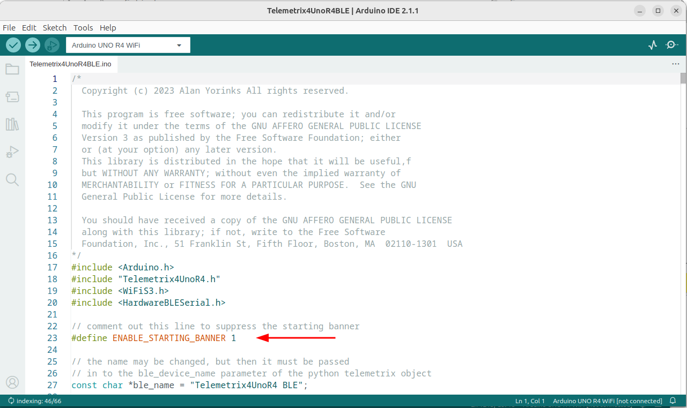
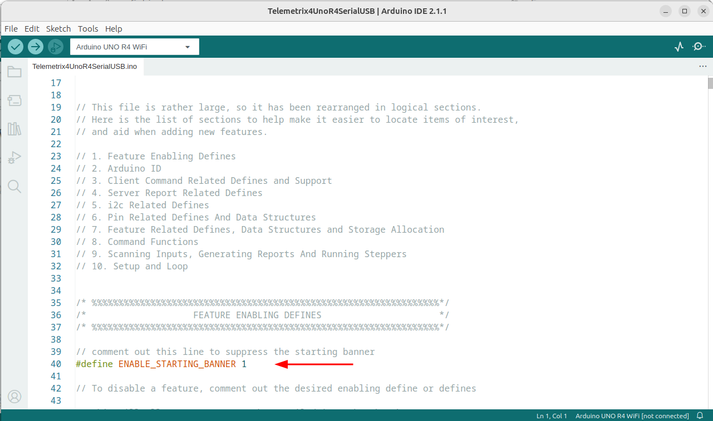
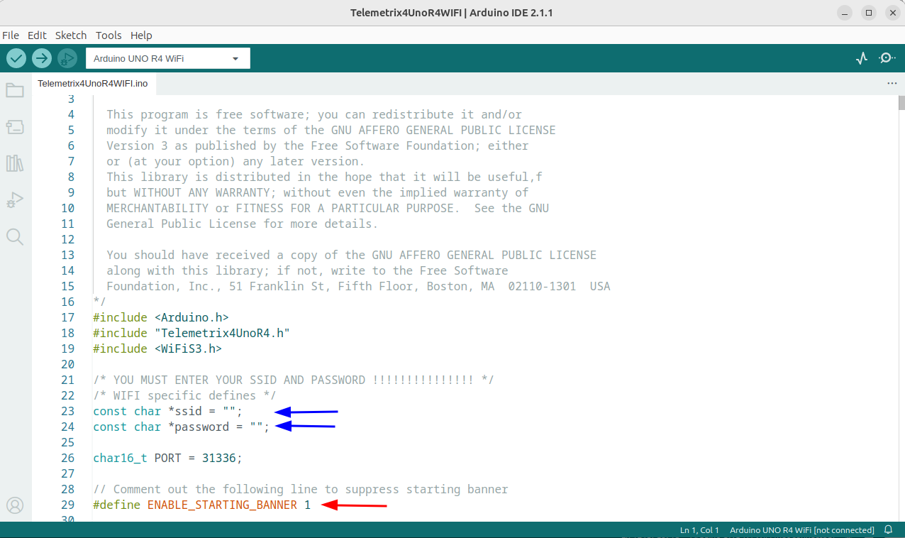

## Arduino UNO R4 Minima

The Minima requires no configuration.

## Arduino UNO R4 WIFI

### Telemetrix4UnoR4BLE



#### Starting Banner Enable

By default, when you power up the Arduino, the sketch is identified by the message
"Telemetrix BLE" scrolling across the display. This message will be extinguished once a 
client application connects.

You may disable the power on scrolling by commenting out the line that says
```angular2html
#define ENABLE_STARTING_BANNER 1
```

The client API method, enable_scroll_message, which allows you to create and scroll your
own message
across the display, still functions even if you disable the starting banner.


#### BLE Name
The ble_name string is the name the BLE client will search for to connect. You may 
change the default value, but if you do, you must also set the 
ble_device_name parameter in the \__init__ method when you 
instantiate telemetrix_uno_r4_wifi_aio.

### Telemetrix4UnoR4SerialUSB



#### Starting Banner Enable

By default, when you power up the Arduino, the sketch is identified by the message
"USBSerial" scrolling across the display. This message will be extinguished once a 
client application connects.

You may disable the power on scrolling by commenting out the line that says
```angular2html
#define ENABLE_STARTING_BANNER 1
```

The client API method, enable_scroll_message, allows you to create and scroll your
own message
across the display, and it still functions even if you disable the starting banner.

### Telemetrix4UnoR4Wifi



#### Required Configuration

##### SSID
Edit the sketch and place your router's SSID between the quotes.

##### PASSWORD

Edit the sketch and place your router's PASSWORD between the quotes.


#### Starting Banner Enable

If the starting banner is enabled, and you forget to set SSID and PASSWORD in the sketch,
a series of question marks will scroll across the screen.

Once you have a valid SSID and PASSWORD configured, the IP address assigned by the 
router will be displayed. 

You may disable the power on scrolling by commenting out the line that says
```angular2html
#define ENABLE_STARTING_BANNER 1
```

The client API method, enable_scroll_message, allows you to create and scroll your
own message
across the display, and it still functions even if you disable the starting banner.


<BR>
Copyright (C) 2023 Alan Yorinks. All Rights Reserved.