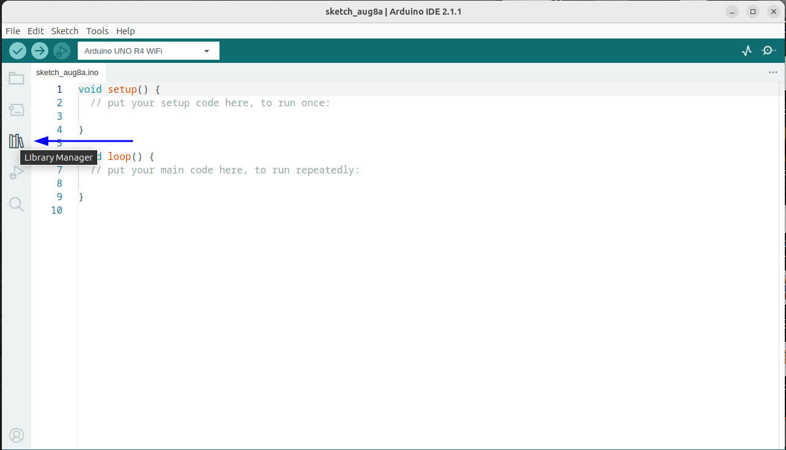
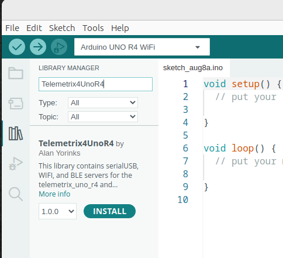
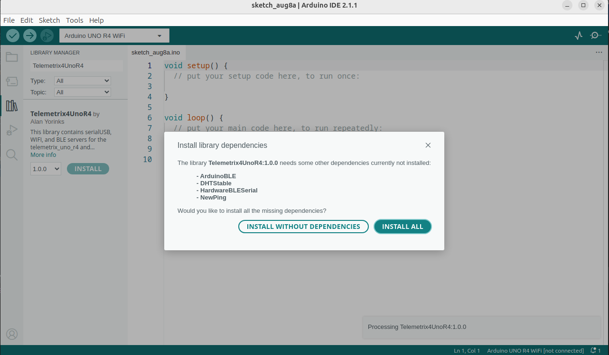

## Add The Arduino4UnoR4 Library To The IDE

1. Open the Arduino IDE and click on the library icon.

    

1. In the search box, type Telemetrix4UnoR4, and when the library is found, click INSTALL.

    

1. You will be prompted to install all of the dependencies. Select INSTALL ALL.

    

## Additional Steps If You Wish To Use The BLE Server

Follow the [instructions on this link](https://forum.arduino.cc/t/radio-module-firmware-version-0-2-0-is-now-available/1147361)
to make sure that you have the correct version of 
the radio firmware installed and to install the Beta version of the ArduinoBLE library.

 