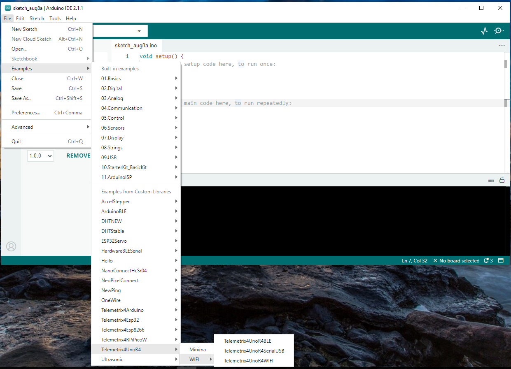

## Choose A Server

Select File from the Arduino IDE main menu and then select Examples.

Next, select TelemetrixUnoR4 from the example selections.

There are four servers to choose from:

* Arduino UNO R4 Minima
    * Minima - utilizing a serial transport via the USB port.
  
* Arduino UNO R4 WIFI
    * Telemetrix4UnoR4BLE - utilizing a BLE transport.
    * Telemetrix4UnoR4SerialUSB - utilizing serial transport via the USB port.
    * Telemetrix4UnoR4WIFI - utilizing a WIFI transport.

 